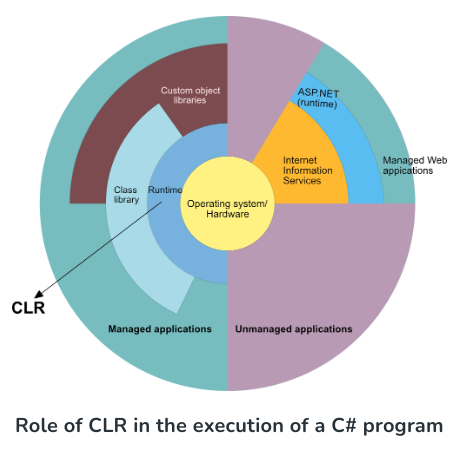
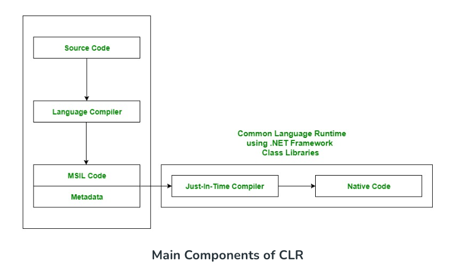

## Dynamic in CSharp

# ¿Qué se entiende por DLR y CLR en .NET?

## DLR

El **Dynamic Language Runtime** (DLR) es un entorno de tiempo de ejecución que agrega un conjunto de servicios para lenguajes dinámicos del **Common Language Runtime** (CLR). El DLR facilita el desarrollo de lenguajes dinámicos para ejecutarse en .NET Framework (IronPython y IronRuby) y añade características dinámicas a lenguajes de tipado estático.

El Dynamic Language Runtime se basa en la idea de que es posible implementar especificidades de lenguaje sobre un árbol de sintaxis abstracta genérico y agnóstico al lenguaje, cuyos nodos corresponden a una funcionalidad específica que es común a muchos lenguajes dinámicos. Esta arquitectura se respalda en la idea de que el número de constructos de lenguaje elementales que tendrían que implementarse en la pila genérica debería ser inherentemente limitado. El DLR genera dinámicamente código que corresponde a la funcionalidad expresada por estos nodos. El compilador para cualquier lenguaje dinámico implementado sobre el DLR tiene que generar árboles abstractos DLR y entregárselos a las bibliotecas DLR.

El DLR proporciona objetos DynamicSite que se actualizan dinámicamente y que almacenan en caché la tarea de vincular métodos a objetos. Dado que el tipo de un objeto, así como los miembros que contiene, en lenguajes dinámicos puede cambiar durante la vida de un programa, una invocación de método debe verificar la lista de métodos para ver si la invocación es válida. Los objetos DynamicSite representan y almacenan en caché el estado del objeto y sus métodos; cualquier actualización en el objeto se refleja también en los objetos DynamicSite. El DLR enruta todas las invocaciones de método a través de los objetos DynamicSite, los cuales luego realizan una búsqueda rápida y vinculación del método con la implementación real.

## CLR

El **Common Language Runtime** (CLR) es un componente del .NET Framework de Microsoft que gestiona la ejecución de aplicaciones .NET. Es responsable de cargar y ejecutar el código escrito en varios lenguajes de programación .NET, incluyendo C#, VB.NET, F# y otros.

Cuando se compila un programa en C#, el código ejecutable resultante está en un lenguaje intermedio llamado **Common Intermediate Language** (CIL) o **Microsoft Intermediate Language** (MSIL). Este código no es específico de la máquina, y puede ejecutarse en cualquier plataforma que tenga instalado el CLR. Cuando se ejecuta el código CIL, el CLR lo compila en código de máquina que puede ser ejecutado por el procesador.

El CLR proporciona muchos servicios a las aplicaciones .NET, incluyendo gestión de memoria, seguridad, manejo de excepciones y seguridad de tipos. También proporciona compilación Just-In-Time (JIT), que compila el código CIL en código de máquina sobre la marcha mientras se ejecuta el programa, optimizando el rendimiento.

Además, el CLR proporciona un marco para el desarrollo y despliegue de aplicaciones .NET, incluyendo un conjunto de bibliotecas, llamadas .NET Framework Class Library, que proporcionan acceso a una amplia gama de funcionalidades, como operaciones de entrada/salida, redes, conectividad a bases de datos y diseño de interfaces de usuario.





El CLR (Common Language Runtime) es el componente básico y de Máquina Virtual del .NET Framework. Es el entorno de tiempo de ejecución en el .NET Framework que ejecuta los códigos y ayuda a facilitar el proceso de desarrollo proporcionando diversos servicios. Básicamente, es responsable de gestionar la ejecución de programas .NET independientemente del lenguaje de programación .NET que se utilice. Internamente, CLR implementa el VES (Sistema de Ejecución Virtual), que está definido en la implementación de Microsoft del CLI (Common Language Infrastructure).

El código que se ejecuta bajo el Common Language Runtime se denomina Código Administrado. En otras palabras, se puede decir que CLR proporciona un entorno de ejecución administrado para los programas .NET mejorando la seguridad, incluyendo la integración entre lenguajes y un rico conjunto de bibliotecas de clases, etc. CLR está presente en cada versión del .NET Framework.


> DLS (Dynamic Language Runtime) y CLR (Common Language Runtime) no están en el mismo nivel de arquitectura de .NET, pero ambos son componentes fundamentales de la plataforma .NET. La confusión puede surgir debido a la evolución y la reorganización de las tecnologías dentro del ecosistema .NET.

- CLR (Common Language Runtime): Es el motor de ejecución que maneja la ejecución del código, la asignación de memoria, y el manejo de recursos. Proporciona características como la recolección de basura, el manejo de excepciones, y la seguridad del código, asegurando un rendimiento confiable y eficiente de las aplicaciones 

- DLS (Dynamic Language Runtime): DLS se refiere a la capacidad de .NET para ejecutar lenguajes de programación dinámicos, como Python o Ruby, a través de IronPython o IronRuby. Estos proyectos permiten que el código escrito en estos lenguajes se ejecute en la plataforma .NET, aprovechando las características de CLR para la gestión de memoria, seguridad, y otras funcionalidades.

> En resumen, CLR es el motor de ejecución central de .NET, proporcionando servicios fundamentales para la ejecución de código, mientras que DLS se refiere a la capacidad de .NET para ejecutar lenguajes de programación dinámicos, aprovechando las características de CLR. Por lo tanto, DLS y CLR no están en el mismo nivel de arquitectura, pero DLS depende de CLR para proporcionar su funcionalidad.

```c#
using System;
using System.Collections.Generic;
using System.Dynamic;

public static class Program
{
     public static void Main()
     {
          var person = Factory.New(
              "FirstName", "Louis",
              "LastName", "Dejardin",
              "Manager", Factory.New(
                   "FirstName", "Bertrand",
                   "LastName", "Le Roy"
               )
          );
          
          Console.WriteLine(person.FirstName);
          Console.WriteLine(person.LastName);
          Console.WriteLine(person.Manager.FirstName);
          Console.WriteLine(person.Manager.LastName);
     }
}
public static class Factory
{
     public static dynamic New(params dynamic[] parameters)
     {
          return new Person(parameters);
     }
}
public class Person : DynamicObject
{
     private readonly dynamic properties = new ExpandoObject();
     public Person(params dynamic[] parameters)
     {
          bool par = true;
          string lastName = "";
          foreach (var item in parameters)
          {
               if (par)
               {
                    lastName = item as string;
               }
               else
               {
                    (properties as IDictionary<string, object>)[lastName] = item;
               }
               par = !par;
          }
     }
     public override bool TrySetMember(SetMemberBinder binder, object value)
     {
          (properties as IDictionary<string, object>)[binder.Name] = value;
          return true;
     }
     public override bool TryGetMember(GetMemberBinder binder, out object result)
     {
          return (properties as IDictionary<string, object>).TryGetValue(binder.Name, out result);
     }
}
```

Este código contiene la implementación de Factory con su método new que permite instanciar objectos conocidos en run-time.
```
using System;

public class PersonSpanish
{
    public readonly string _name;
    public PersonSpanish(string name)
    {
        _name = name;
    }
    public void Saluda()
    {
        Console.WriteLine("Hola desde {0}", _name);
    }
}

public class PersonEnglish
{
    public readonly string _name;
    public PersonEnglish(string name)
    {
        _name = name;
    }
    public void Saluda()
    {
        Console.WriteLine("Hello from {0}", _name);
    }
}

public static class Program
{
    public static void Main()
    {
        Console.WriteLine("Que tipo de persona quieres usar ?");
        Type type = Type.GetType(Console.ReadLine()); // get the type to use at runtime

        // Create an instance of the type
        
        // find a constructor for the type taking one argument
        // if not this blow up.
        
        // return something dynamic to allow call methods on it that we assume they will have.
        var person = Factory.New(type, "BritoAlv");

        // call assumed method to have.
        person.Saluda();
    }
}
public static class Factory
{
    public static dynamic New(Type type, params object[] parameters)
    {
        return Activator.CreateInstance(type, parameters);
    }
}
```

Aquí sigue el código generado por el compilador donde se pueden ver por ejemplo el CallSite generado.

```csharp
using System;
using System.Diagnostics;
using System.Reflection;
using System.Runtime.CompilerServices;
using System.Security;
using System.Security.Permissions;
using Microsoft.CSharp.RuntimeBinder;

[assembly: CompilationRelaxations(8)]
[assembly: RuntimeCompatibility(WrapNonExceptionThrows = true)]
[assembly: Debuggable(DebuggableAttribute.DebuggingModes.IgnoreSymbolStoreSequencePoints)]
[assembly: SecurityPermission(SecurityAction.RequestMinimum, SkipVerification = true)]
[assembly: AssemblyVersion("0.0.0.0")]
[module: UnverifiableCode]
[module: RefSafetyRules(11)]

[NullableContext(1)]
[Nullable(0)]
public class PersonSpanish
{
    public readonly string _name;

    public PersonSpanish(string name)
    {
        _name = name;
    }

    public void Saluda()
    {
        Console.WriteLine("Hola desde {0}", _name);
    }
}

[NullableContext(1)]
[Nullable(0)]
public class PersonEnglish
{
    public readonly string _name;

    public PersonEnglish(string name)
    {
        _name = name;
    }

    public void Saluda()
    {
        Console.WriteLine("Hello from {0}", _name);
    }
}

public static class Program
{
    [CompilerGenerated]
    private static class <>o__0
    {
        public static CallSite<Action<CallSite, object>> <>p__0;
    }

    public static void Main()
    {
        Console.WriteLine("Que tipo de persona quieres usar ?");
        Type type = Type.GetType(Console.ReadLine());
        object[] array = new object[1];
        array[0] = "BritoAlv";
        object arg = Factory.New(type, array);
        if (<>o__0.<>p__0 == null)
        {
            Type typeFromHandle = typeof(Program);
            CSharpArgumentInfo[] array2 = new CSharpArgumentInfo[1];
            array2[0] = CSharpArgumentInfo.Create(CSharpArgumentInfoFlags.None, null);
            <>o__0.<>p__0 = CallSite<Action<CallSite, object>>.Create(Microsoft.CSharp.RuntimeBinder.Binder.InvokeMember(CSharpBinderFlags.ResultDiscarded, "Saluda", null, typeFromHandle, array2));
        }
        <>o__0.<>p__0.Target(<>o__0.<>p__0, arg);
    }
}

public static class Factory
{
    [NullableContext(1)]
    [return: Dynamic]
    public static object New(Type type, params object[] parameters)
    {
        return Activator.CreateInstance(type, parameters);
    }
}
```

Como el objeto *person* es dinámico es postergado a el Run-Time resolver el método Saluda, para expresar eso el compilador genera una clase estática interna a *Program*, que contiene un método el CallSite que sería un delegado, que representará que ahí debe haber un método *Saluda*, solo que es en el run-time cuando es insertado. El chequeo que se hace dentro del *Main* es para verificar si ya se obtuvo el método previamente para no volverlo a hacer ya que es cacheado, como un *Memoaize*, en caso de que cuando sea búscado no es encontrado, entonces es lanzada una excepción.

Entre las características que debe poseer un lenguaje de programación para *embedding* un lenguaje de dominio específico están:

Un Lenguaje de dominio específico es un lenguaje especializado a el dominio de cierta aplicación, por ejemplo *MakeFile* es un DSL orientado a dar instrucciones sobre como compilar y enlazar un programa. Otros ejemplos pueden ser:  *HTML, Mapple, Matematica*. Entre las características de un lenguaje que facilitan la creación de *DSL* son:

 - Metaprogramación: Se refiera a la habilidad de los programas de tratar otros programas como su entrada, pudiendo leer, analizar, o transformar otros programas, o el mismo, mientras está ejecutándose. 

```csharp
using System.Linq.Expressions;
using System;
public class C {
    public void M() {
        Expression<Func<int, int, int>> add = (a, b) => a + b;
        var result = add.Compile().Invoke(1, 2);
        Console.WriteLine(result);
    }
}
```

```csharp
public class C
{
    [Serializable]
    [CompilerGenerated]
    private sealed class <>c
    {
        public static readonly <>c <>9 = new <>c();
    }

    public void M()
    {
        ParameterExpression parameterExpression = Expression.Parameter(typeof(int), "a");
        ParameterExpression parameterExpression2 = Expression.Parameter(typeof(int), "b");
        BinaryExpression body = Expression.Add(parameterExpression, parameterExpression2);
        ParameterExpression[] array = new ParameterExpression[2];
        array[0] = parameterExpression;
        array[1] = parameterExpression2;
        Console.WriteLine(Expression.Lambda<Func<int, int, int>>(body, array).Compile()(1, 2));
    }
}
```

- Reflection: Permite a un programa inspeccionar su propia estructura a través de tipos.

```golang
	for {
		fmt.Print(">> ")
		command := read_input()
		// use reflection to execute a command.
		parts := strings.Split(command, " ")
		if len(parts) == 0 {
			fmt.Println("Que haces Calavera")
			continue
		}
		command_name := parts[0]

		if command_name == "exit" {
			break
		}

		method := reflect.ValueOf(&X).MethodByName(strings.ToUpper(command_name))

		if !method.IsValid() {
			fmt.Println("Calavera pon algo que entienda... como help")
			continue
		}
		method.Call([]reflect.Value{reflect.ValueOf(strings.TrimSpace(command[len(command_name):]))})
	}
```

- Funciones como objetos: Funciones que pueden tomar como argumentos otras funciones y devolver funciones como resultados. 

```haskell
map :: (a -> b) -> [a] ->[b]
```

- Polimorfismo: Proveer de una interfaz para ser usada por varios tipos, y por tanto para una clase general de acciones.

```python
class Car:
  def __init__(self, brand, model):
    self.brand = brand
    self.model = model

  def move(self):
    print("Drive!")

class Boat:
  def __init__(self, brand, model):
    self.brand = brand
    self.model = model

  def move(self):
    print("Sail!")

class Plane:
  def __init__(self, brand, model):
    self.brand = brand
    self.model = model

  def move(self):
    print("Fly!")

car1 = Car("Ford", "Mustang")       #Create a Car class
boat1 = Boat("Ibiza", "Touring 20") #Create a Boat class
plane1 = Plane("Boeing", "747")     #Create a Plane class

for x in (car1, boat1, plane1):
  x.move()
```

- Flexibilidad en el syntax: Por ejemplo si es posible refedinir operadores, puede ser más sencillo modelar el dominio del problema.

```haskell
(<^>) :: Int -> Int -> Int
a <^> b = a + b
```


```csharp
static void Main(string[] args)
{
    dynamic d = 10;
    C c = new C();

    // (1) Dynamic receivers.
    d.Foo(); // Call.
    d.PropOrField = 10; // Property.
    d[10] = 10; // Indexer.

    // (2) Statically typed receivers (or static methods)
    //     with dynamic arguments.
    c.Foo(d); // Instance method call.
    C.StaticMethod(d); // Static method call.
    c.PropOrField = d; // Property.
    c[d] = 10; // Indexer.
    d++; // Think of this as op_increment(d).
    var x = d + 10; // Think of this as op_add(d, 10).
    int x = d; // Think of this as op_implicit(d).
    int y = (int)d; // Think of this as op_explicit(d).
}
```

Sobre *Binding, Call Site, Receivers*:

Cuando el compilador encuentra una expresión de tipo dynamic, sabe que debe tratar las subsecuentes operaciones con él como dynamic, ya sea un *index get*, *method call*, etc. El tipo del resultado de la operación va a ser determinado en runtime, y por tanto en *compile-time* el resultado de la operación es también *dynamic*.

El compilador transforma todas las operaciones dinámicas, en lo que se llama un *dynamic call site*. El compilador guarda un campo estático generado en una clase estática generada en la que el *DLR* reserva espacio para la invocación e inicialización si es necesario. Este es un objeto genérico en el tipo del delegado de el llamado. Esta creación toma como argumentos un *CallSiteBinder* que es un objeto que sabe como hacer el *binding* específico requerido por el *call site*. El *call site* contiene un campo de tipo T que es una instancia de el tipo de el delegado con el que se está instanciando el *call site*, el cual es usado por el mecanismo de cacheo de el *DLR*. Guarda los resultados de cada *bind* y es usado para invocar la operación resultante. Una vez que el *call site* ha sido creado, el compilador emite el código para invocar el delegado, pasando los argumentos pasador por el usuario a el *call site*.

Una vez que el compilador ha creado el *DLR call site*, invoca a el delegado, en caso de que este no sea un *IDynamicObject*, y tampoco tengamos un cache hit ( primera vez que se inicializa), entonces se usará el *CallSiteBinder* de *C#* para hacer el binding, que devolverá un *expression tree* que puede ser cacheado para futuros usos.

En el ejemplo, hay tres diferentes tipos de operaciones dinámicas. Hay un *call*, un *property access*, y un *indexer*. Cada una de esas operaciones tiene su parte propia, pero comparten mucha funcionalidad en común. Son todas inicializadas con un común *binder*, el proveido por *C#*, y son usadas por este como *data objects* que describen la acción que necesita ser *bound*, son llamados esos objetos *payloads*.

En C# el binder, se refiere a una clase abstracta en el namespace *System.Reflection* que define métodos para la selección de métodos, propiedades y constructores a ser invocados usando *Reflection*.

El *C# runtime binder* es una especie de minicompilador que posee una *symbol-table, type system, overload resolution, type substitution*, etc.

Por ejemplo *d.Foo(1)*, el runtime binder, toma todos los argumentos incluyendo a el receptor *d*, y guarda en su *symbol-table* estos tipos, y usa reflection para cargar todos los miembros llamados *Foo* en el runtime type de d, guardandolos en una *symbol-table*. 

Con esa información debería ser suficiente para determinar que método ejecutar. El resultado de la *bind* operation es un *expression-tree* en caso de que todo haya ido bien que después es mezclado con el delegado de el *CallSite* para ser parte de el *DLR* cache mecanismo, y después invocado, de forma que el resultado de el user's dynamic bind es ejecutado.

Un ejemplo de ExpresionTree puede ser:

```csharp
using System;
using System.Linq.Expressions;

public class MultiplyToAddVisitor : ExpressionVisitor
{
    protected override Expression VisitBinary(BinaryExpression node)
    {
        // If the node is a multiplication operation, change it to addition
        if (node.NodeType == ExpressionType.Multiply)
        {
            // Visit the left and right operands
            Expression left = this.Visit(node.Left);
            Expression right = this.Visit(node.Right);

            // Change the multiplication operation to addition
            return Expression.Add(left, right);
        }

        // Otherwise, handle the node as usual
        return base.VisitBinary(node);
    }
}

public class Program
{
    public static void Main()
    {
        // Create an expression to multiply two numbers
        ParameterExpression param1 = Expression.Parameter(typeof(int), "a");
        ParameterExpression param2 = Expression.Parameter(typeof(int), "b");
        BinaryExpression multiplyExpression = Expression.Multiply(param1, param2);

        // Compile and execute the expression
        var multiplyFunc = Expression.Lambda<Func<int, int, int>>(multiplyExpression, param1, param2).Compile();
        Console.WriteLine(multiplyFunc(3, 4));  // Outputs 12

        // Now modify the expression to add the numbers instead
        MultiplyToAddVisitor visitor = new();
        Expression addExpression = visitor.Visit(multiplyExpression);

        // Compile and execute the modified expression
        var addFunc = Expression.Lambda<Func<int, int, int>>(addExpression, param1, param2).Compile();
        Console.WriteLine(addFunc(3, 4));  // Outputs 7
    }
}
```